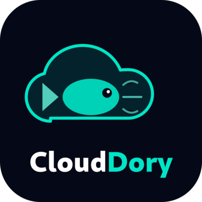

<p align="center">
  
</p>

<h1 align="center">CloudDory</h1>

<p align="center">
  <strong>Free & open-source cloud operations platform.</strong><br>
  FinOps, Security, Threat Intelligence & SOAR — all in one dashboard.<br>
  Built with AI. Self-hosted. No vendor lock-in.
</p>

<p align="center">
  <a href="https://clouddory.com">Website</a> &bull;
  <a href="https://dashboard.clouddory.com">Live Demo</a> &bull;
  <a href="https://clouddory.com/resources/docs/">Docs</a> &bull;
  <a href="mailto:alanvo@gmail.com">Contact</a>
</p>

<p align="center">
  
  
  
  
  
</p>

---

## What is CloudDory?

CloudDory replaces 5+ cloud tools with one unified, self-hosted platform:

| Module | What It Does |
|--------|-------------|
| **FinOps** | Cost explorer, waste scanner, anomaly detection, AiTags virtual tagging, shared cost allocation, savings forecasting |
| **Security** | CVE tracking from NVD + CISA KEV, security posture (CSPM), compliance monitoring, vulnerability management |
| **Threat Intelligence** | IOC management, threat feeds, adversary profiles, intel reports |
| **Automation (SOAR)** | Automated playbooks, workflow integrations, incident response |
| **DoryAI** | AI assistant powered by Gemini, OpenAI, or Anthropic — page-aware, answers questions about your cloud data |

Built with Next.js 14, TypeScript, Tailwind CSS, Prisma, and MariaDB.

## Live Demo

See CloudDory in action at **[dashboard.clouddory.com](https://dashboard.clouddory.com)** and **[clouddory.com](https://clouddory.com)**.

## Screenshots

<details>
<summary>Cost Explorer</summary>

- 5 chart types (bar, stacked bar, line, area, stacked area)
- Multi-dimension grouping (service, provider, team, region)
- Filter chips, date range picker, CSV export
- Drill down to individual cost line items with plain-English explanations

</details>

<details>
<summary>CVE Tracking</summary>

- 65+ CVEs synced from NVD and CISA KEV
- Severity scoring, CVSS, exploit/patch availability
- Per-org tracking (status, assignee, notes)
- Affected resource matching against your cloud inventory

</details>

<details>
<summary>DoryAI Assistant</summary>

- Page-aware: knows which page you're on
- Answers questions about your costs, security posture, CVEs
- Powered by Gemini/OpenAI/Anthropic (bring your own keys)
- Available as floating widget on every page

</details>

## Quick Start

### Prerequisites

- Node.js 18+
- MySQL or MariaDB 10.5+
- npm

### 1. Clone and install

```bash
git clone https://github.com/ALANDVO/clouddory.git
cd clouddory/apps/dashboard
npm install
```

### 2. Configure environment

```bash
cp ../../.env.example .env
# Edit .env with your database URL and secrets
```

### 3. Set up database

```bash
npx prisma db push
npx prisma generate
```

### 4. Build and run

```bash
npm run build
npm start
```

Open **http://localhost:3000** — the first user to register becomes admin.

### Docker (recommended)

```bash
git clone https://github.com/ALANDVO/clouddory.git
cd clouddory
docker-compose up -d
```

Open **http://localhost:3000**.

## Configure AI

Go to **Settings > AI Config** to add your API keys via the UI:

- **Google Gemini** (recommended — free tier available)
- **OpenAI** (GPT-4o, GPT-4)
- **Anthropic** (Claude 3.5 Sonnet, Claude 3 Haiku)
- **OpenRouter** (access to 100+ models)

Keys are encrypted at rest with AES-256-CBC.

## Connect Cloud Accounts

**Settings > Cloud Accounts > Connect**

| Provider | Method |
|----------|--------|
| AWS | CloudFormation template (1-click IAM role setup) + CUR |
| GCP | Service account with Billing Viewer role |
| Azure | App registration with Cost Management Reader role |

Read-only access only. CloudDory never writes to your cloud accounts.

## Architecture

```
clouddory/
├── apps/
│   ├── dashboard/     # Main application (Next.js 14, SSR)
│   ├── admin/         # Admin panel (Next.js 14)
│   └── landing/       # Marketing site (Next.js 14, static export)
├── prisma/            # Database schema + seeds
├── docker-compose.yml # One-command deployment
├── .env.example       # Environment template
└── README.md
```

### Tech Stack

| Layer | Technology |
|-------|-----------|
| Frontend | Next.js 14, TypeScript, Tailwind CSS, Recharts, Framer Motion |
| Backend | Next.js API Routes, Prisma ORM |
| Database | MySQL / MariaDB |
| Auth | NextAuth.js (email/password + Google OAuth) |
| AI | Gemini, OpenAI, Anthropic (via API) |
| CVE Data | NVD API v2.0, CISA KEV catalog |

## Features (53 pages, 67 API routes)

### FinOps & Cost Optimization
- CloudLens Cost Explorer with 5 chart types
- AWS integration (CloudFormation + STS + Cost Explorer API)
- Waste Scanner (idle resources, rightsizing, orphaned storage)
- Anomaly detection with configurable thresholds
- AiTags virtual tagging engine
- Shared cost allocation (telemetry or custom %)
- Commitment tracker (RIs, Savings Plans, CUDs)
- Resource inventory with drill-down to line items
- Savings forecasting, manual entry, CSV export

### Security & Compliance
- CVE tracking synced from NVD + CISA KEV
- CVE detail pages with remediation steps (stays in-app)
- Affected resource matching (agentless)
- Security posture scoring
- Per-org status tracking (new > reviewing > mitigated)
- CISA KEV "actively exploited" flagging

### Platform
- DoryAI chat assistant (page-aware, real data context)
- 20+ connector integrations (AWS, GCP, Azure, Datadog, Snowflake, K8s, OpenAI, Anthropic)
- Custom dashboards with drag-and-drop widgets
- Query builder for ad-hoc reports
- Spend planning with budget vs actual
- Team showback (shareable public links)
- Blog CMS (write in admin, publish to site)
- Feedback system (bug reports, feature requests)
- Notification system with bell dropdown
- API key management, SSO config, IP whitelist

## Self-Hosted — Your Data, Your Control

- All data stays in **your** database
- No telemetry, no phone-home, no usage tracking
- Bring your own AI keys — we never see them
- Read-only cloud access — we never write to your infrastructure
- AES-256-CBC encryption for stored credentials

## Contributing

PRs welcome! See [CONTRIBUTING.md](CONTRIBUTING.md) for guidelines.

1. Fork the repo
2. Create your feature branch (`git checkout -b feature/amazing-feature`)
3. Commit your changes (`git commit -m 'Add amazing feature'`)
4. Push to the branch (`git push origin feature/amazing-feature`)
5. Open a Pull Request

## Author

**Alan Vo** — AI & Cloud Infrastructure Developer

- Email: [alanvo@gmail.com](mailto:alanvo@gmail.com)
- GitHub: [@ALANDVO](https://github.com/ALANDVO)
- Website: [clouddory.com](https://clouddory.com)

Alan is an AI-focused software developer specializing in building intelligent cloud platforms. CloudDory was built using AI-augmented development — from the NLP-powered DoryAI assistant to the Gemini-integrated cost analysis engine. His work spans full-stack development, AI/ML integration, cloud infrastructure automation, and cybersecurity tooling.

**Other projects:** [Soverint](https://soverint.com) (threat intelligence platform), [FeedPacket](https://feedpacket.com) (AI-powered analytics)

Interested in AI development, cloud architecture, or want to collaborate? Reach out at [alanvo@gmail.com](mailto:alanvo@gmail.com).

## Support

- Email: [alanvo@gmail.com](mailto:alanvo@gmail.com)
- Issues: [github.com/ALANDVO/clouddory/issues](https://github.com/ALANDVO/clouddory/issues)
- Demo: [dashboard.clouddory.com](https://dashboard.clouddory.com)
- Docs: [clouddory.com/resources/docs](https://clouddory.com/resources/docs/)

## License

[MIT](LICENSE) — free to use, modify, and distribute.

---

<p align="center">
  Built by <a href="mailto:alanvo@gmail.com">Alan Vo</a> &bull;
  <a href="https://clouddory.com">clouddory.com</a> &bull;
  <a href="https://github.com/ALANDVO/clouddory">Star on GitHub</a>
</p>
